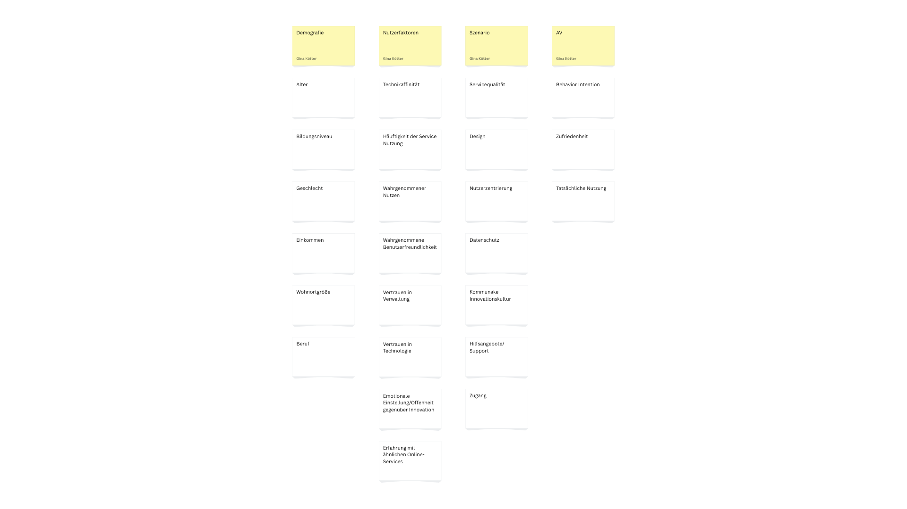

## Teammitglieder 
*Gina Kötter
*Karolina Braun 
*Samira Eisenberg


## Forschungsfrage 
"Welche Faktoren beeinflussen die Nutzungsbereitschaft von innovativen Services der Kommunalverwaltung?"


## Hypothesen

### Unterschiedshypothesen

- Männer und Frauen unterscheiden sich in ihrer Nutzungsbereitschaft von innovativen Services der Kommunalverwaltung.  
- Personen mit hohem Bildungsniveau und Personen mit niedrigem Bildungsniveau unterscheiden sich in ihrer Nutzungsbereitschaft von innovativen Services der Kommunalverwaltung.  
- Personen unterschiedlichen Alters unterscheiden sich in ihrer Nutzungsbereitschaft von innovativen Services der Kommunalverwaltung.  
```feedback
H3 ist okay, solange Sie nicht die selbe Hypothese als Zusammenhangshypothese haben. Trotzdem sollten Sie hier bitte die Gruppenabstufungen angeben.
````

### Unterschiedshypothese (MANCOVA)

- Personen unterschiedlicher Berufsgruppen unterscheiden sich in ihrer Nutzungsbereitschaft gegenüber innovativen Services der Kommunalverwaltung.  

```feedback
Das passt, nimmt Ihnen aber die Möglichkeit, einen Interaktionseffekt zu untersuchen. Im Hinblick auf die Klausur würde ich ihnen empfehlen, sich diese Möglichkeit nicht zu verbauen. Fügen Sie hierzu einfach eine weitere UV in die Hypothese hinzu. 
````

### Zusammenhangshypothesen

- Es gibt einen Zusammenhang zwischen der Einstellung gegenüber Innovation und der Nutzungsbereitschaft von innovativen Services der Kommunalverwaltung.  
- Es gibt einen Zusammenhang zwischen dem Alter einer Person und der Nutzungsbereitschaft von innovativen Services der Kommunalverwaltung.  
```feedback
Siehe oben ;-) Bitte formulieren Sie eine andere Unterschiedshypothese.
````
- Es gibt einen Zusammenhang zwischen dem Vertrauen in Verwaltung und der Nutzungsbereitschaft von innovativen Services der Kommunalverwaltung.  

### Zusammenhangshypothese (Multiple lineare Regression)

- Die Technikaffinität, der wahrgenommene Nutzen, das Vertrauen in Technologie sowie die Häufigkeit der bisherigen Servicenutzung beeinflussen die Nutzungsbereitschaft innovativer kommunaler Services.

```feedback
Das passt, allerdings haben Sie relativ oft die Nutzungsbereitschaft von innovativen Sercives als AV, was ein bisschen nach p-Hacking aussieht (Erklärung später). Für diese Woche ist das noch absolut okay, später sollten Sie die Hypothesen eventuell nochmal anpassen und z.B. mit den Szenarien etwas variieren.
````

### Messinstrument

[Technophobie](https://zis.gesis.org/skala/Sinkovics-Technophobie?redirect_url=https%253A%252F%252Fzis.gesis.org%252Fsearch%253Fsource%253D%257B%2522query%2522%253A%257B%2522bool%2522%253A%257B%2522must%2522%253A%255B%257B%2522query_string%2522%253A%257B%2522query%2522%253A%2522v)

### Messinstrument

[Technikbereitschaft](https://zis.gesis.org/skala/Neyer-Felber-Gebhardt-Kurzskala-Technikbereitschaft-%28TB,-technology-commitment%29?lang=de)

